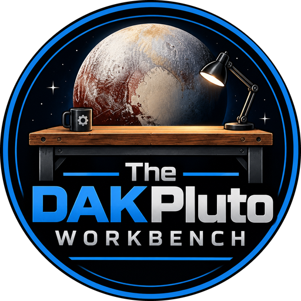

<p align="center"></p>

# DAKPluto Workbench

A personal digital workshop: a place to collect ideas, experiments, questions, tools and half-finished things, and to rediscover them later.

## Run it

```sh
npm install
npm run dev      # http://localhost:5173
npm run build    # static site in dist/
```

## How it's put together

- **Vite + React + TypeScript**, no backend. Deploys as a static site (Cloudflare Pages, Netlify, GitHub Pages). Configure the host to serve `index.html` for unknown paths.
- **Data lives in the browser** (IndexedDB via Dexie). Use **Export / Import** in the sidebar to back up or move between browsers.
- `src/model/artifact.ts`: the data model. Everything is an `Artifact`. Types and statuses are open strings with a small display registry. Relationships are `Link` records in their own table.
- `src/store/`: the **only** code that touches persistence. Swap its internals to add sync or a server later; the UI shouldn't need to change.
- `src/lib/discovery.ts`: the resurfacing heuristics (forgotten things, unfinished business, recurring tags). This is where smarter discovery goes.
- `src/shelves.ts`: sidebar views are filters over the one collection. A new shelf is one entry.
- `src/components/Brand.tsx`: the badge, the blue rule and the plank. Badge images are cut from the logo (`docs/brand/`) into `public/brand/`.
- `src/views/`: the bench (landing), shelves (lists + search) and the artifact page (inline editing, status, connections).

## Shortcuts

- `/` focuses search. `#tag` in search filters by tag.
- In the capture box: `idea: some thought #tag` sets type and tags. **Enter** adds it, **Ctrl+Enter** adds and opens it.

## License

MIT. See [LICENSE](LICENSE).
